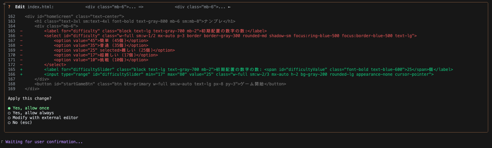
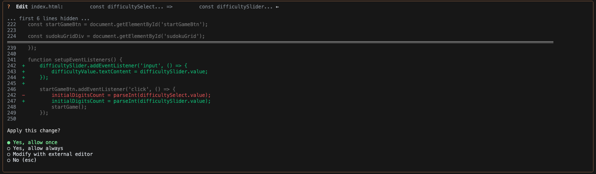
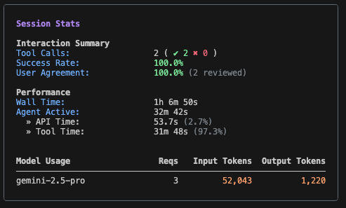
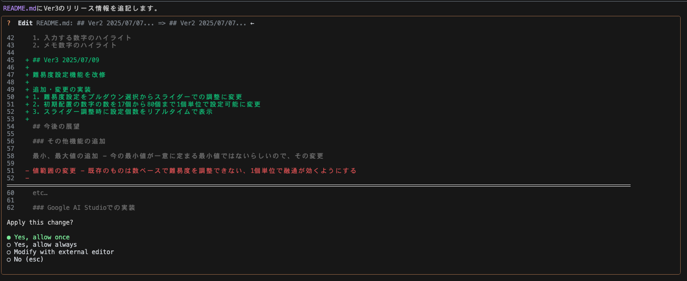
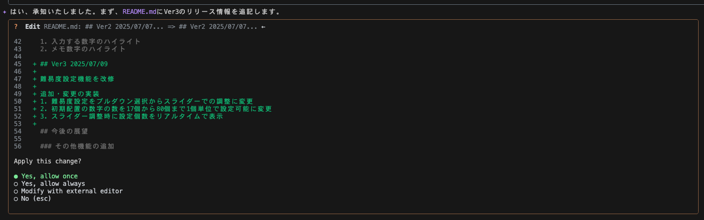
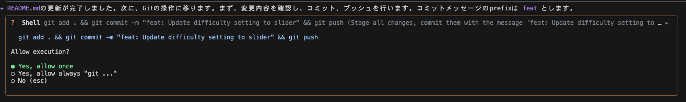

# 3-1 (2025/07/09)
## Prompt

@index.html
ゲームの最初に設定できる数の範囲を今10個から45個まで設定できるが、まず、範囲を理論上最小の17から最大の80までを範囲にしてほしい
そして、今5種類の数しか選択できないが、スライダーを動かして、1個単位で選べるようにしてほしい
また、スライダーを動かすと、今何個の設定なのかもしっかり表示させるように連動させてほしい@

## Answer
✦ はい、承知いたしました。index.htmlを修正し、数独ゲームの初期設定機能を更新します。

  具体的には、以下の変更を加えます。


   1. 初期配置の数字の数を設定する方法を、ドロップダウンリストからスライダーに変更します。
   2. スライダーの範囲を17から80までに設定します。
   3. スライダーを動かすと、選択されている数字の数がリアルタイムで表示されるようにします。


  まず、HTMLの選択メニューをスライダーに置き換えます
  

  次に、JavaScriptコードを更新して、新しいスライダーの動作を制御します。
  

## Reflection

差分が表示されるのは、CLIならではの機能でありかなり便利だった

何が変わるのかがわかりやすい分、比較しやすい上にコードを書いていない自分でも何をしてiるのかが頭に残りやすい

また、一度に全ての機能を実装しないのはgit管理目線でかなり助かるものであった

そうなると、プロンプト(1度ではなく毎度読み込ませる用のプロンプト)にgit操作もするように頼むこともできれば、まさにより良いバイブコーディングにつながりそうである

またコードの可読性も良いが、addEventListenerを用いることで、useStateなどを使わなくてもレンダリングを実現させている点も良かった

制約条件をプロンプトに読み込ませれば、それに合う問題を作ることができる期待感もある

AIに関係ないが、コンポーネントも増えることから、React, あるいはNext.jsへの移行、Vercelなどでのデプロイ、もしくはバックエンド(問題生成用、途中保存用)もありかもしれない



# 3-2(2025/07/10)
## Prompt

(ついでにリリースノートも書かせてみる)

@README.md
今回実装した内容をVer3のリリース情報としてこのREADMEに追加して
そして、適切なprefixをつけて、リモートリポジトリにプッシュして

## Answer


# 3-3(2025/07/10)
## Prompt

(最大、最小値の修正もさせているのに、それは判定できていない、もうそこは自分で修正する)
@README.md
今回実装した内容をVer3のリリース情報としてこのREADMEに追加して
今後の展望に関しては、自分で処理する
そして、適切なprefixをつけて、リモートリポジトリにプッシュして

## Answer




## Reflection

今後の展望も修正してくれるのが便利だが、最大、最小を今回の初期設定数値のことと認識できていないようだった

READMEを見返すと確かに目的語がないので、AIがというより自分自身の修正すべき点

ただ改修内容は、この程度の量だとしっかりできているし、1, 2と段落でできているのも、自分の書き方が踏襲されていて非常に良い

git操作をさせるなら、prefixルールも細かく教える必要がある(markdownならdocs, featより自分はadd)
そもそもgitのログを読み込ませれば、できたかもしれないが、CLIにそのlogファイルを読み込ませることはできるのか？

最後にコードの提案に対して、細かな修正が行えない点が不便に感じたが、
`Modify with external editor`で修正できるかもしれない

でもできればプロンプトで修正させられるようにもしたい, その調査が必要

一応調べた感じ、やり直す時に前の文章を丸々載せなくても会話は続けられるらしいが、やはりNoneをする手間を省くことはできなさそう

# 4-1(2025/07/11)
## prompt

(まず現在の問題生成ロジックを知る)
@index.html これの数独パズルを生成している箇所とどうやって生成しているかについて教えて 

## Answer
```
はい、承知いたしました。index.html のコードから数独パズルの生成ロジックを解説します。

  パズルを生成している箇所

  パズルの生成は、<script> タグ内にある以下の3つの主要な関数によって行われています。


   1. startGame(): ゲーム全体の開始を管理する関数です。
   2. solveSudoku(board): バックトラッキングというアルゴリズムを使い、完全に解かれた数独盤（解答）を1つ生成します。
   3. createPuzzle(solvedBoard, numToKeep): 完成した数独盤から、指定された数のヒント数字だけを残して問題を作成します。

  生成の仕組み


  パズルは、大きく分けて2つのステップで生成されます。

  ステップ1: 完全な数独盤（解答）の生成


   1. startGame() 関数が呼び出されると、まず solveSudoku() 関数が実行されます。
   2. solveSudoku() は、空のマスを見つけて、1から9までの数字をランダムな順番で入れてみます。（shuffleArray
      関数で数字の配列をシャッフルしています）
   3. 数字を入れるたびに isValidPlacement()
      関数で、その数字が数独のルール（同じ行、列、3x3のブロックに同じ数字がない）に違反していないかチェックします。
   4. ルールに合っていれば、次の空きマスに進んで同じ処理を繰り返します。もしルールに違反するか、行き詰まった場合は、一つ前のマス
      に戻って別の数字を試します（これをバックトラッキングと呼びます）。
   5. これを繰り返して、全てのマスが埋まった完全な数独盤（solutionBoard）が一つ完成します。

  ステップ2: 問題（穴あき盤）の生成


   1. 次に startGame()
      は、ステップ1で作成した完全な盤（solutionBoard）と、ユーザーが設定した初期配置の数字の数（initialDigitsCount）を引数にして
      createPuzzle() 関数を呼び出します。
   2. createPuzzle() は、まず完成盤のコピーを作成します。
   3. 81個ある全てのマスをランダムな順番に並び替えます。
   4. そして、並び替えた順番に従って、盤面から数字を消して空マス（0）に変えていきます。この処理を「81 -
      初期配置の数」だけ繰り返します。
   5. これにより、ユニークな解を持つ可能性のある、穴あきのパズル盤（puzzleBoard）が完成し、ゲーム画面に表示されます。


  このように、まず解答を完全に作成してから、そこからランダムにマスを消していくことで、解くことが可能な数独パズルを生成しています。
```

## Reflection
実際のコードの引用しながら教えてくれる感じではない

関数名を出すだけだから、少しわかりにくい上に、ファイルを開けないといけない

# 4-2(2025/07/11)
## prompt
@index.html 今の数独問題生成ロジックでユーザーは一意の答え、それ以外にないただ一つの答えを自力で解くことが可能なことは保証されている？
保証されていないなら、どうするべき？

## Answer
```
ご指摘の通り、現在の数独問題生成ロジックでは、答えが一意である（ただ一つの答えしかない）ことは保証されていません。


  なぜ保証されていないのか


  現在の createPuzzle 関数は、完成した盤面からランダムに数字を消しているだけです。どの数字を消せば答えが複数になってしまうか、ある
  いは解けなくなってしまうか、というチェックを行っていません。そのため、偶然にも複数の解を持つ問題や、極端な場合には（非常に稀です
  が）解けない問題が生成されてしまう可能性があります。

  どうするべきか：解の一意性を保証する改善策


  ユーザーが論理的に解き進められる、質の高い数独パズルを提供するためには、「数字を一つ消してみて、それでも答えが一つに定まるか」を
  毎回チェックしながら問題を作成する必要があります。

  以下にそのための具体的な改善方法とコードを示します。

  方針:


   1. ある盤面の解がいくつあるかを数える関数 countSolutions(board) を新しく作ります。
   2. createPuzzle 関数を改造し、ランダムに選んだマスを一つ空にします。
   3. すかさず countSolutions() で、その盤面の解が 1 であることを確認します。
   4. もし解が 1 であればそのマスは空にしたままで、次のマスを空にしにいきます。もし解が 1
      以外（0個や2個以上）になってしまったら、そのマスを空にするのは諦めて、元の数字に戻します。
   5. これを繰り返して、指定された数のマスを空にしていきます。


  この手順により、生成される問題は必ず一意の解を持つことが保証されます。

  コードの修正

  以下の様に、createPuzzle関数を置き換え、新たにcountSolutions関数を追加してください。
  (以下略, 次commitに掲載)
```
これで、生成されるすべての数独問題の答えがただ一つであることが保証され、ユーザーは論理的な思考だけで解けるようになります。

## Reflection
大きく変化するところはターミナル上じゃなくて、VSCodeのこのエディタ上で差分を見たい

25個で解いてみたが、ヒントなしではおそらく解けなさそう


唯一解を持つ and プレイヤーが論理的に当てずっぽうなしで解けることが必要になりそう
