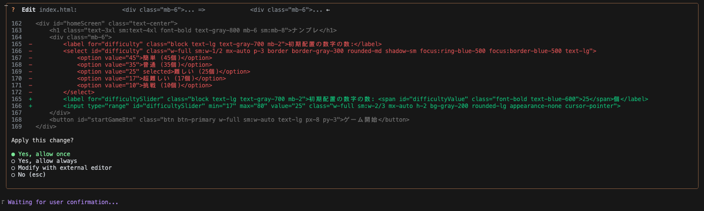
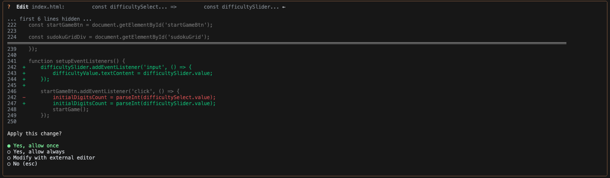

# 3-1 (2025/07/09)
## Prompt

@index.html
ゲームの最初に設定できる数の範囲を今10個から45個まで設定できるが、まず、範囲を理論上最小の17から最大の80までを範囲にしてほしい
そして、今5種類の数しか選択できないが、スライダーを動かして、1個単位で選べるようにしてほしい
また、スライダーを動かすと、今何個の設定なのかもしっかり表示させるように連動させてほしい@

## Answer
✦ はい、承知いたしました。index.htmlを修正し、数独ゲームの初期設定機能を更新します。

  具体的には、以下の変更を加えます。

   1. 初期配置の数字の数を設定する方法を、ドロップダウンリストからスライダーに変更します。
   2. スライダーの範囲を17から80までに設定します。
   3. スライダーを動かすと、選択されている数字の数がリアルタイムで表示されるようにします。

  まず、HTMLの選択メニューをスライダーに置き換えます
  

  次に、JavaScriptコードを更新して、新しいスライダーの動作を制御します。
  
