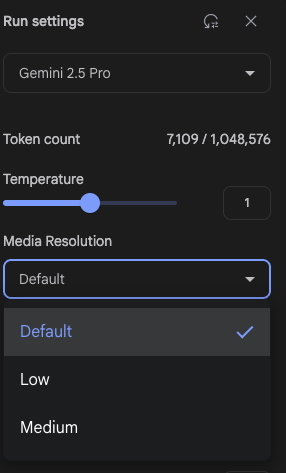
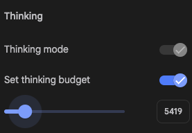
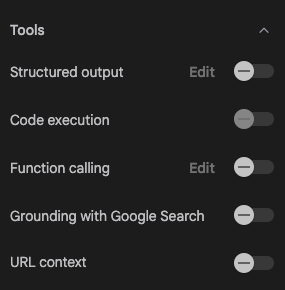
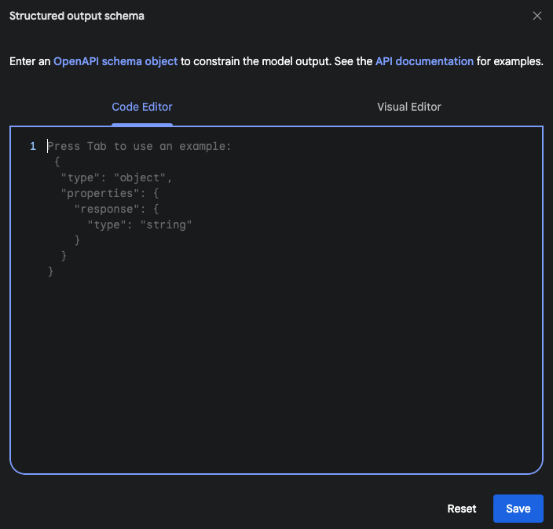
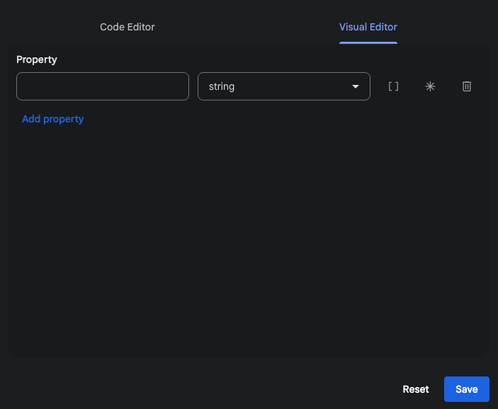
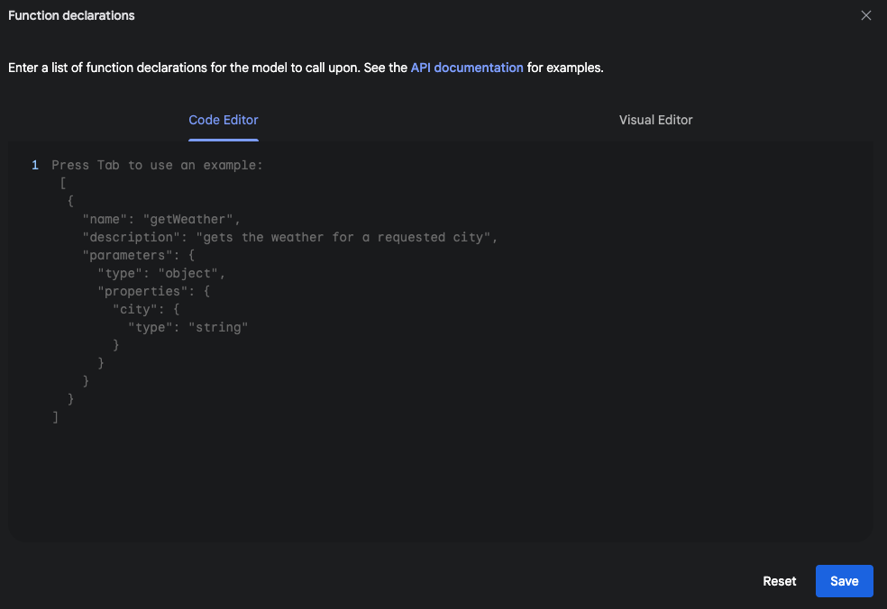
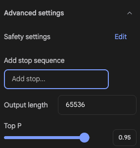

# Google AI Studio
2025/07/07現在

Gemini 2.5 pro 

1日に無料で100万トークンを利用できる

[100万トークンからのプラン(公式)](https://ai.google.dev/gemini-api/docs/pricing?hl=ja)

## Settings(Chat)
Chatでの設定

### 実行設定 (Run settings)
AIの基本的な振る舞いをここで決めます。

- モデル (Gemini 2.5 Pro): どのAIモデルを使用するかを選択します。性能や得意なことが異なる様々なモデルを選べます。

- トークンカウント (Token count): モデルが一度に扱える情報量（コンテキストウィンドウ）の上限と、現在の使用量を示します。

- 温度 (Temperature): 応答の「創造性」を調整します。

    - 低い値 (0に近い): より予測可能で、事実に基づいた堅実な応答になります。

    - 高い値 (1に近い): より創造的で、多様な、時には意外な応答になります。

- メディア解像度 (Media Resolution): 画像などを入力した際の、認識・処理の精細さを設定します。

### 思考(Thinking)

- 思考モード (Thinking mode): より複雑な推論（チェーン・オブ・ソート）をモデルに許可し、回答の質を向上させます。

- 思考の予算 (Set thinking budget): 思考モード利用時の計算量やステップの上限を設定します。

### ツール (Tools)
AIに特定の能力を与え、より高度なタスクを実行させます。

- 構造化出力 (Structured output): モデルの出力を、JSONのような特定の構造化フォーマットに強制します。

- コード実行 (Code execution): モデルが問題解決のために、Pythonコードを自ら書いて実行できるようになります。

- 関数呼び出し (Function calling): 開発者が定義した外部の関数やAPIを、モデルが呼び出せるようになります。

- Google検索によるグラウンディング (Grounding with Google Search): モデルがGoogle検索を使い、最新の情報や事実に基づいて回答を生成するようになります。

- URLコンテキスト (URL context): 指定されたURLの内容をモデルが読み取り、その情報を元に応答できるようになります。

### 詳細設定(Advanced Settings)

- セーフティ設定 (Safety settings): モデルが生成するコンテンツの安全性を調整します。例えば、「ハラスメント」や「危険なコンテンツ」などを、どのくらい厳しくブロックするかを設定できます。

- 停止シーケンスの追加 (Add stop sequence): ここで特定の単語や記号（例: 「 や 。）を設定すると、モデルがその文字列を生成した瞬間に、応答を強制的に停止させることができます。

- 出力の長さ (Output length): モデルが生成する応答の最大トークン数（おおよその文字数）の上限です。これによって、応答が長くなりすぎるのを防ぎます。

- Top P:「温度 (Temperature)」と似ていますが、応答の多様性をコントロールする別の方法です。次に生成する単語の候補を、確率の高いものから順に選び、その確率の合計がこの設定値（例: 0.95 = 95%）に達するまでのグループの中から、ランダムに単語を選びます。

    - 高い値 (1に近い): 応答がより多様でクリエイティブになります。

    - 低い値 (0に近い): 応答がより決まりきった、予測しやすいものになります。

